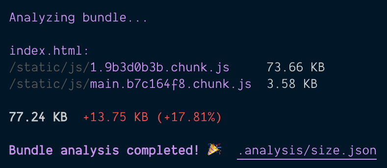
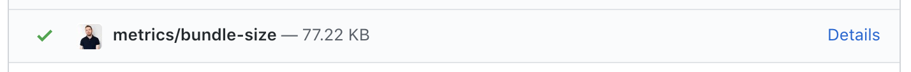

analyze-cra-bundle
==================

[](https://oclif.io)
[](https://npmjs.org/package/analyze-cra-bundle)
[](https://npmjs.org/package/analyze-cra-bundle)
[](https://github.com/petecorreia/analyze-cra-bundle/blob/master/package.json)


### Keep an eye on your bundle size 📦

Assess impact of any code on the bundle size directly in your Pull Request changes 🔎

# Usage

```bash
$ analyze-cra-bundle
```

Generates a report at `.reports/build-analysis.json`. Check the file into git to track changes to bundle size when compared to latest master 🎉



Then it's easy to spot the diff in a Pull Request 👀



⚠️ **Warning**: Make sure to build your app before running the command: `yarn build`

### Options:

```bash
$ analyze-cra-bundle --branch=master path/to/build/folder
```

